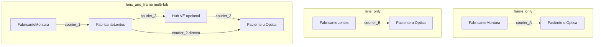

# Cadena de suministro — Zonix Glasses

> Orquestación multi-fabricante y multi-courier. Canon operativo para ops y diseño de producto.  
> Decisiones founder: [DECISIONES_FOUNDER.md](DECISIONES_FOUNDER.md) §8–§11.

## Principio rector

Zonix no fabrica: **coordina** fabricantes (lentes, monturas, o ambos) y **couriers** por tramo. Cuando la montura y los lentes vienen de fabricantes distintos, la **montura viaja al lab de lentes** para ensamblaje antes del envío final.

## Matriz: composición × escenario fabricante

|  | Un solo fabricante (lentes + monturas) | Fabricante montura + fabricante lentes | Solo un tipo en pedido |
|--|----------------------------------------|----------------------------------------|-------------------------|
| **`frame_only`** | 1 orden montura → courier → cliente | N/A (solo montura) | Montura → cliente — ver [FLUJOS_OPERATIVOS.md](FLUJOS_OPERATIVOS.md) **6A-stock** / **6A-MTO** (§12) |
| **`lens_only`** | 1 orden lab → lentes → cliente | 1 orden lab → lentes → cliente | Lab → cliente |
| **`lens_and_frame`** | 1 orden integrada → cliente | **Montura → lab** → lentes montados → cliente | Ver fila correspondiente |

## Tramos logísticos (courier por tramo)

Cada tramo = un `ShipmentLeg` + un `Courier` (pueden repetirse carriers o ser distintos).

## Flujo detallado: montura → lab (confirmado founder)

1. Paciente paga pedido `lens_and_frame` con montura SKU de **Fab A** y lentes de **Fab B**.
2. Zonix emite **SupplierOrder** a Fab A: despachar montura a dirección del lab Fab B.
3. Courier tramo 1: tracking independiente (montura en tránsito).
4. Fab B confirma recepción → orden pasa a `awaiting_frame_at_lab` → `in_lens_production`.
5. Fab B produce lentes, monta en la montura recibida, despacha producto terminado.
6. Courier tramo 2 (+ aduana VE si aplica): tracking hasta entrega.

**Responsable del producto terminado:** fabricante de lentes (Fab B).

## Checklist operativo (excepciones)

| Situación | Acción ops Zonix |
|-----------|------------------|
| Montura no llega al lab en X días | Escalar Fab A; pausar SLA; notificar paciente |
| Montura dañada en tramo 1 | Reclamo a courier/Fab A; reenvío montura |
| Lab rechaza montura (incompatible) | Validación catálogo pre-checkout; disputa `[PENDIENTE política]` |
| Solo montura — sin lab | Envío directo Fab montura o **stock VE** → destino (sin fórmula) |
| Pedido solo lentes | Sin tramo inter-fabricante |

## Inventario monturas (`frame_only` — §12 founder)

| Modo | Fulfillment |
|------|-------------|
| **Stock VE** (top sellers) | Pick/pack local → courier última milla |
| **Contra pedido** | SupplierOrder al fabricante → courier directo |

Capital de trabajo en stock top SKUs: ver [LEAN_CANVAS.md](LEAN_CANVAS.md) §7.

## Pendientes founder (§11)

1. **Flete montura→lab:** ¿incluido en PVP, paga Zonix, o Fab montura?
2. **Courier:** ¿Zonix unifica contrato o cada fab usa el suyo?
3. **SLA ~30 días `[PENDIENTE §11]`:** ¿desde `paid` o desde montura recibida en lab?
4. **Catálogo:** reglas cuando SKU montura (Fab A) se combina con lab (Fab B) no homologado.
5. **Hub VE:** ¿consolidación obligatoria o envío directo lab→paciente?

## Referencias

- [FLUJOS_OPERATIVOS.md](FLUJOS_OPERATIVOS.md) — flujos 5–6 (6A-stock / 6A-MTO)
- [DOMINIO_DATOS.md](../DOMINIO_DATOS.md) — entidades logísticas; flags `Frame.in_stock_ve`
- [POLITICA_COMERCIAL.md](POLITICA_COMERCIAL.md) — disputas multi-tramo, stock VE, Pagos VE + FX §13
- [POLITICA_CANAL_ALIADO.md](POLITICA_CANAL_ALIADO.md) — §14 canal B2B2C / mayorista
- [UNIT_ECONOMICS.md](UNIT_ECONOMICS.md) — plantilla margen por `order_type`
- [AUDIT_FORENSE_2026-06-27.md](../AUDIT_FORENSE_2026-06-27.md) — §11 pendiente founder
