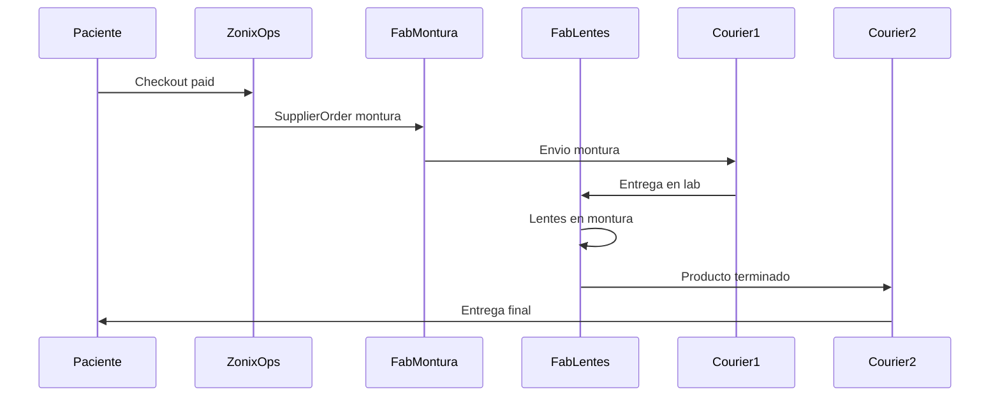

# Flujos operativos — Zonix Glasses

## Flujo 0 — Tipo de pedido (ramificación)

Al iniciar compra, el paciente (o partner) elige composición:

| Tipo | Fórmula | Try-on montura | Lab lentes |
|------|---------|----------------|------------|
| `frame_only` | No | Sí | No |
| `lens_only` | Sí (flujo 2) | No | Sí |
| `lens_and_frame` | Sí (flujo 2) | Sí | Sí + montura enviada al lab |

Ver [CADENA_SUMINISTRO.md](CADENA_SUMINISTRO.md).

## Flujo 1 — Alta paciente bajo óptica

1. Paciente se registra (Google/email) o lo registra la óptica aliada.
2. Sistema asigna `optical_partner_id` (QR/código aliado, link invitación o selección en onboarding).
3. Se crea **historial clínico vacío** vinculado al paciente (`PatientProfile`).

## Flujo 2 — Captura de fórmula *(solo `lens_only` y `lens_and_frame`)*

### Entrada (3 vías)

1. **Paciente trae receta:** foto/PDF upload o lectura manual asistida.
2. **Medición / carga profesional:** optometrista o partner ingresa esfera, cilindro, eje, adición, PD, etc.
3. **IA OCR:** foto de fórmula en papel o PDF → borrador estructurado.

### Validación en 3 capas (antes de fabricar lentes)

| Capa | Actor | Acción |
|------|-------|--------|
| a | Óptica aliada o profesional Zonix | Aprueba graduación → estado `approved` |
| b | IA | Solo precarga; resultado siempre `pending_review` hasta humano |
| c | Paciente | Confirma explícitamente → `patient_confirmed` |

### Distancia pupilar (DP)

- Obligatoria antes de `approved` (campo `pd` y opcional `pd_near`).
- Orden preferido: medición óptica/Zonix → paciente ingresa si conoce → IA estima (fase 2).

### Estados `Prescription`

```
draft → pending_review → approved → patient_confirmed → locked_for_order
                              ↘ rejected / superseded
```

**Salida usable en catálogo de lentes:** mínimo `patient_confirmed`.

## Flujo 3 — Selección de lente *(lens_only / lens_and_frame)*

1. Con fórmula `patient_confirmed`, catálogo devuelve **materiales compatibles** por fabricante/lab `[PENDIENTE founder: tabla pricing]`.
2. Paciente elige material por ojo si aplica.
3. Precio parcial se acumula en carrito.

## Flujo 4 — Catálogo monturas + try-on IA *(frame_only / lens_and_frame)*

### Modo A — Exploración

1. Paciente sube **fotos faciales** (frontal, perfil) con guía UX.
2. Navega catálogo de monturas (precio, fabricante, talla si aplica).
3. Al seleccionar montura → **try-on IA** superpone montura en su rostro.

### Modo B — Recomendación

1. Tras fotos, IA sugiere monturas según forma de rostro / ancho puente `[PENDIENTE founder: reglas]`.
2. Muestra try-on de recomendaciones ranked.

**`frame_only`:** checkout posible tras elegir montura (sin flujos 2–3).

## Flujo 5 — Carrito y checkout

Líneas según `order_type`:

| Tipo | Líneas carrito |
|------|----------------|
| `frame_only` | Montura (+ talla) |
| `lens_only` | Fórmula bloqueada + material lente |
| `lens_and_frame` | Fórmula + material + montura |

Servicios opcionales (AR, fotocromático) `[PENDIENTE founder]`.

Checkout:

1. Resumen total transparente (desglose por fabricante si aplica).
2. **Prepago 100%** — pago manual VE.
3. Orden: `pending_payment_validation` → `paid` → orquestación fulfillment (flujo 6).

## Flujo 6 — Fulfillment multi-fabricante

### 6A — `frame_only` (§12 mixto)

#### 6A-stock — SKU `in_stock_ve`

1. Reserva inventario local VE (pick/pack).
2. Courier última milla → paciente u óptica aliada.
3. Sin `SupplierOrder` a fabricante salvo reposición backorder.

#### 6A-MTO — SKU `made_to_order`

1. Zonix genera `SupplierOrder` al **fabricante de montura**.
2. Fabricante despacha con **courier** directo a destino.
3. Tracking por tramo hasta `delivered`.

### 6B — `lens_only`

1. Zonix genera `SupplierOrder` al **fabricante de lentes** (spec: fórmula `locked_for_order`, material, PD).
2. Lab produce lentes (montura del cliente existente fuera de alcance MVP `[PENDIENTE]`).
3. Courier lab → destino final.

### 6C — `lens_and_frame` (fabricantes distintos — confirmado founder)

1. **SupplierOrder montura** → fabricante de montura envía montura al **fabricante de lentes** (courier tramo 1).
2. Estado orden: `awaiting_frame_at_lab` hasta recepción en lab.
3. **SupplierOrder lentes** → lab fabrica y monta lentes en esa montura → `in_lens_production`.
4. Lab despacha **producto terminado** con courier tramo 2+ → VE / última milla → paciente u óptica.

### 6D — `lens_and_frame` (mismo fabricante)

1. Un solo `SupplierOrder` con spec completa; sin tramo inter-fabricante.

Pago a fabricantes: tras `paid` del paciente; posible pago escalonado por tramo `[PENDIENTE founder]`.

## Flujo 7 — Recompra

1. Paciente accede a fórmulas previas (solo pedidos con lentes).
2. "Reordenar" prellena material/montura; nueva confirmación si fórmula > N meses `[PENDIENTE founder]`.

## Estados orden (canónico — ver [DOMINIO_DATOS.md](../DOMINIO_DATOS.md))

```
draft_cart → pending_payment_validation → paid
  → awaiting_frame_shipment (lens_and_frame, multi-fab)
  → awaiting_frame_at_lab
  → in_lens_production
  → shipped → in_customs → out_for_delivery → delivered
  ↘ cancelled / disputed
```

## Diagrama (lens_and_frame, multi-fabricante)



## Pendientes founder

Ver [DECISIONES_FOUNDER.md](DECISIONES_FOUNDER.md) §11 (flete inter-fab, courier, SLA, catálogo cross-fab).

- Regulación emisión fórmula en VE.
- Tabla precios materiales vs dioptrías.
- INCOTERM y aduanas por tramo.
- % comisión aliado definitivo.

## Referencias

- [DECISIONES_FOUNDER.md](DECISIONES_FOUNDER.md)
- [POLITICA_COMERCIAL.md](POLITICA_COMERCIAL.md)
- [CADENA_SUMINISTRO.md](CADENA_SUMINISTRO.md)

**Última actualización:** 2026-06-27
