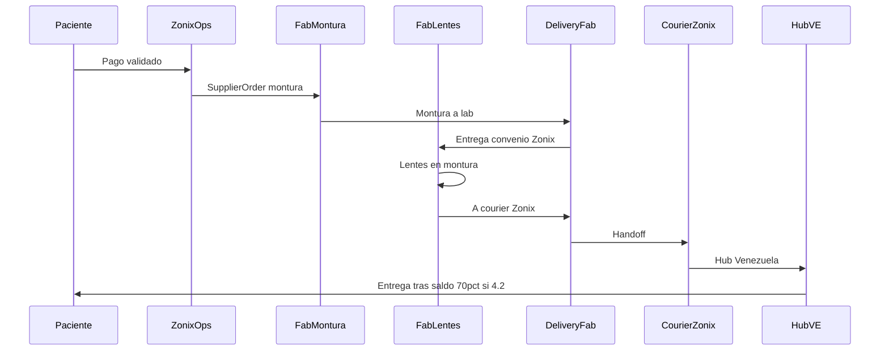

# Flujos operativos — Zonix Glasses

> Modelo v3 — pagos directo 4.1/4.2; aliado 100% mayor; hub obligatorio.  
> [DECISIONES_FOUNDER.md](DECISIONES_FOUNDER.md) · [POLITICA_COMERCIAL.md](POLITICA_COMERCIAL.md)

## Flujo 0 — Tipo de pedido (ramificación MVP)

| Tipo | MVP | Fórmula | Try-on (Flujo 4) | Lab |
|------|-----|---------|------------------|-----|
| `frame_only` | Sí | No | Sí — varias fotos → preview montura | No |
| `lens_and_frame` | Sí | Sí (flujo 2) | Sí — varias fotos → preview montura | Sí + montura al lab |
| `lens_only` | **No** | — | — | Fase 2 |

Matriz canónica: [DECISIONES_FOUNDER.md](DECISIONES_FOUNDER.md) §8.

## Flujo 1 — Alta paciente bajo óptica

1. Paciente se registra o lo registra la óptica aliada (panel partner logueado).
2. Sistema asigna `optical_partner_id` — atribución persistente al aliado.
3. Se crea **PatientProfile** e historial clínico en tenant del aliado.
4. En sesión aliado: captura facial + try-on IA (§17).

## Flujo 2 — Captura de fórmula *(solo `lens_and_frame` MVP)*

Entrada: receta paciente, carga profesional, IA OCR.

Validación **a+b+c** — ver [DECISIONES_FOUNDER.md](DECISIONES_FOUNDER.md) §1.

Estados: `draft` → `pending_review` → `approved` → `patient_confirmed` → `locked_for_order`.

## Flujo 3 — Selección de lente *(lens_and_frame)*

1. Fórmula `patient_confirmed` → catálogo materiales por fabricante.
2. Paciente elige material; precio parcial al carrito (PVP directo o contexto aliado).

## Flujo 4 — Captura facial + marketplace web + try-on (monturas)

> Canon: [DECISIONES_FOUNDER.md](DECISIONES_FOUNDER.md) §17 · entidad `FaceCapture` en [DOMINIO_DATOS.md](../DOMINIO_DATOS.md).

**Plataforma:** **web** (navegador) — storefront paciente y panel óptica aliada. UX PDP referencia: marketplace tipo AliExpress/Alibaba (desktop 2 columnas + scroll). **No** flujo mobile app nativo como canon de este marketplace.

**Aplica** a canal directo y aliado. **No** sustituye flujo de fórmula (Flujo 2).

1. Paciente acepta **consentimiento** uso de imagen facial (simulación visual, no diagnóstico).
2. **Captura guiada (web):** varias **fotos reales** del rostro vía cámara web o upload (frente + ángulos; luz y rostro descubierto).
3. Sistema persiste `FaceCapture` (`images[]`, `analysis`).
4. IA **analiza el rostro** a partir del set completo.
5. **PLP web — marketplace monturas:** grid de tarjetas con thumbnail `catalog_images[]` (producto solo, sin rostro).
6. Paciente **clic en montura** → **PDP web** (detalle producto):
   - **Columna izquierda — galería:** modo **«Ver en ti»** (try-on: su rostro + montura) **o** modo **fotos producto** (`catalog_images[]`); miniaturas para alternar.
   - **Columna derecha — compra:** título, PVP, variantes color, plazo, **Añadir al carrito**.
   - **Scroll inferior:** tabla specs · **diagrama medidas mm** · galería ángulos · (opcional) relacionados.
7. Si calidad de captura insuficiente → repetir paso 2 antes de habilitar modo «Ver en ti».
8. Paciente confirma montura → **añade al carrito** → continúa Flujo 5 (checkout web).

**`frame_only`:** tras paso 8 → checkout (sin Flujos 2–3).

**`lens_and_frame`:** tras paso 8 → Flujo 2 (fórmula a+b+c) si aún no locked → Flujo 3 (material) → Flujo 5.

## Flujo 5 — Carrito y checkout (desglose dinámico v3.1)

1. Paciente elige montura y/o material lente → sistema añade línea `frame` / `lens_lab` con PVP catálogo.
2. Según `order_type` y fulfillment (stock vs MTO), calcula línea `intl_courier` si aplica.
3. Paciente indica dirección / zona → sistema resuelve `ShippingZoneRule`:
   - Si `free_shipping`: línea `last_mile` = 0 (promo).
   - Si no: tarifa delivery VE / courier según tabla admin.
4. Muestra líneas cobrables + línea informativa `iva_info` (IVA **ya incluido** en PVP — no suma al total).
5. **Total checkout** = suma de líneas cobrables (`frame`, `lens_lab`, `intl_courier`, `last_mile`, `discount`); base para pagos 4.1/4.2; persiste `OrderLineItem[]` y agregados en `OpticalOrder` — ver fórmula en [DOMINIO_DATOS.md](../DOMINIO_DATOS.md).
6. Paciente elige modalidad **4.1** o **4.2** (solo canal directo) y sube comprobante.

| Tipo | Líneas checkout |
|------|-----------------|
| `frame_only` stock VE | Montura + última milla (sin `intl_courier`) |
| `frame_only` MTO | Montura + courier intl + última milla |
| `lens_and_frame` | Montura + lentes/lab + courier intl + última milla |

Detalle por fulfillment: [POLITICA_COMERCIAL.md](POLITICA_COMERCIAL.md) § Checkout por order_type.

### Pago — canal directo Zonix

Ver tablas **4.1 / 4.2** y FX en [POLITICA_COMERCIAL.md](POLITICA_COMERCIAL.md) § Base pagos (total checkout = base de cada tramo).

### Pago — canal aliado

1. Flujo panel: captura facial (varias fotos) → try-on preview → carrito → fórmula (si aplica) → T&C → método de pago.
2. Óptica paga **100% mayor** (por SKU) a Zonix + comprobante.
3. **Ops Zonix** recibe notificación, concilia pago y **aprueba** (o cancela) antes de fab.
4. Tras validación → `paid_full` (mayor) → disparo fab.
5. Paciente paga a óptica según política de la óptica (fuera de Zonix).

Checkout aliado = **panel partner** con paciente en contexto del aliado (no canal directo Zonix).

## Flujo 6 — Fulfillment multi-fabricante

**Precondición:** pago validado según §5.

### 6A — `frame_only`

#### 6A-stock — `in_stock_ve`

1. Reserva inventario hub VE.
2. `ShipmentLeg` `last_mile_ve` (hub → destino; `supplier_order_id` null).
3. Delivery VE → paciente u óptica.

#### 6A-MTO — `made_to_order`

1. SupplierOrder fab montura.
2. Delivery fab / courier Zonix → **hub VE** → delivery VE → destino.

### 6B — `lens_and_frame` multi-fab (confirmado v3)

1. SupplierOrder montura → **delivery fab** → fab lentes (convenio Zonix).
2. `awaiting_frame_at_lab` → `in_lens_production` (**inicio SLA ~30 días**).
3. Producto terminado → delivery fab → **courier internacional Zonix**.
4. Courier → **hub VE** → `ready_for_pickup` (si 4.2 pendiente 70%) o delivery VE.
5. Paciente paga 70% si aplica → entrega.

### 6C — `lens_and_frame` mismo fabricante

1. Un SupplierOrder; delivery fab → courier Zonix → hub → destino.

Pago a fabricantes: tras validación pago Zonix (100% directo, 30% directo 4.2, o 100% mayor aliado).

## Flujo 7 — Retención hub (4.2 directo)

1. Llegada hub → avisos pago 70%.
2. **30 días** sin pago → stock físico.
3. Reclamo tardío: paga **70% del total** + **multa**, donde multa = `total × hub_late_pickup_fee_percent` (default 10%, config admin) — [POLITICA_COMERCIAL.md](POLITICA_COMERCIAL.md).

## Flujo 8 — Recompra

Paciente reutiliza fórmulas previas; **reconfirmación obligatoria** si antigüedad **> 12 meses** desde última confirmación (`patient_confirmed` / `locked_for_order`). Ver [DECISIONES_FOUNDER.md](DECISIONES_FOUNDER.md) §16.

## Estados orden (canónico)

```
draft_cart
  → pending_payment_validation
  → deposit_validated          (4.2 — 30% OK)
  → paid_full                  (4.1 o 4.2 saldo o aliado 100% mayor)
  → awaiting_frame_shipment
  → awaiting_frame_at_lab
  → in_lens_production         ← inicio SLA
  → shipped
  → in_customs
  → at_hub
  → ready_for_pickup           (4.2 — saldo pendiente)
  → out_for_delivery
  → delivered
  ↘ cancelled / disputed / forfeited_deposit
```

Ver [DOMINIO_DATOS.md](../DOMINIO_DATOS.md).

## Diagrama (lens_and_frame, multi-fab, v3)



## Referencias

- [DECISIONES_FOUNDER.md](DECISIONES_FOUNDER.md)
- [POLITICA_COMERCIAL.md](POLITICA_COMERCIAL.md)
- [CADENA_SUMINISTRO.md](CADENA_SUMINISTRO.md)

**Última actualización:** 2026-06-27 (§17 UX web PDP — ref. AliExpress/Alibaba)
