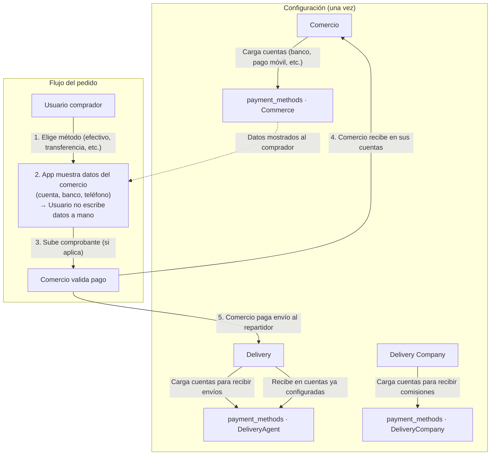
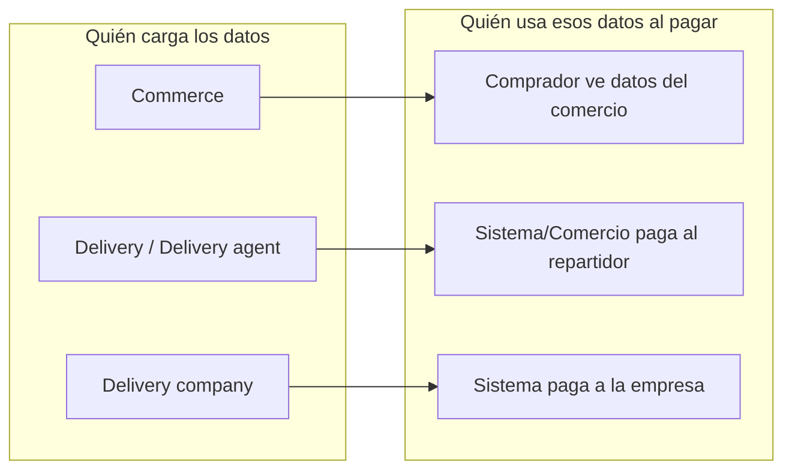

# Lógica de pagos por rol – Zonix Eats

Este documento describe cómo cada rol usa los **métodos de pago** en la app: quién los configura, quién los ve y cómo fluye el dinero.

---

## Idea central: datos cargados de antemano

**Commerce, delivery y delivery_company cargan sus datos de pago una sola vez** (cuentas bancarias, pago móvil, billetera, etc.). Esos datos se guardan en la app.

Cuando llega el momento de pagar:

- **Al comprador** se le muestran los métodos del comercio (a qué cuenta transferir, teléfono de pago móvil, etc.) para que no tenga que pedir o escribir datos a mano.
- **Al comercio** no tiene que repetir su cuenta en cada pedido; la app ya la tiene y la muestra al cliente.
- **Al repartidor / empresa de delivery** se les paga usando los métodos que ellos mismos configuraron (donde quieren recibir el envío o las comisiones).

Es decir: **cada uno carga sus datos; la app rellena la información a la hora de pagar** y evita que el usuario tenga que cargar datos de cuentas bancarias u otros manualmente en cada operación.

---

## Por rol

### 1. Users (comprador / buyer)

| Qué hace | Carga métodos propios | Uso en el flujo de pago |
|----------|------------------------|--------------------------|
| Paga el pedido (comida + envío) | No. No tiene pantalla para “mis cuentas” | Elige **cómo** paga (efectivo, transferencia, tarjeta, pago móvil, etc.) y, si aplica, sube comprobante. La app le **muestra los datos del comercio** (cuenta, banco, teléfono) para que sepa a dónde pagar; no escribe esos datos a mano. |

- No configura cuentas para “recibir” en la app.
- Los métodos que ve al pagar son los del **comercio** de la orden (precargados por el comercio).

---

### 2. Commerce (comercio / restaurante)

| Qué hace | Carga métodos propios | Uso en el flujo de pago |
|----------|------------------------|--------------------------|
| Recibe el pago del cliente (subtotal + envío) | Sí. En **Configuración → Métodos de pago** (tarjeta, pago móvil, transferencia, billetera, otro; no “efectivo” como cuenta) | Esas cuentas son las que la app **muestra al comprador** al pagar (a qué cuenta transferir, número de pago móvil, etc.). El comercio no tiene que dar los datos a mano en cada pedido. |

- Configura una vez: banco, número de cuenta, teléfono pago móvil, etc.
- Cuando el cliente paga, la app **rellena / muestra** esa información al usuario para que pague al comercio sin cargar datos manualmente.

---

### 3. Delivery / Delivery agent (repartidor)

| Qué hace | Carga métodos propios | Uso en el flujo de pago |
|----------|------------------------|--------------------------|
| Recibe el pago del envío (delivery fee) | Sí. En **Más → PAGOS → Métodos de pago** (cuenta bancaria, pago móvil, etc.) | Esas cuentas son donde el repartidor **recibe** el monto del envío. El comercio (o el sistema) usa esos datos precargados para pagarle; el repartidor no tiene que dar datos a mano en cada entrega. |

- Configura una vez dónde quiere recibir.
- La app usa esos datos cuando corresponde pagar al repartidor (100% del `delivery_fee` según reglas de negocio).

---

### 4. Delivery company (empresa de repartidores)

| Qué hace | Carga métodos propios | Uso en el flujo de pago |
|----------|------------------------|--------------------------|
| Recibe pagos o comisiones (ej. de la plataforma o por gestión) | Sí. En **Más → CONFIGURACIÓN DE EMPRESA → Métodos de pago** | Esas cuentas son donde la **empresa** recibe sus pagos. La app usa esos datos precargados para pagar a la empresa; no se introducen manualmente en cada operación. |

- La empresa configura una vez sus cuentas.
- El dueño de los métodos en backend es `DeliveryCompany` (no el repartidor individual).

---

### 5. Admin

- No tiene un flujo de negocio específico de “recibir pagos” en la app.
- Si se usara el API de métodos de pago, el backend trata al admin como User; no hay lógica adicional por rol para admin aquí.

---

## Diagrama: flujo de dinero y uso de métodos de pago

---

## Diagrama: quién configura vs quién usa

---

## Resumen en una frase por rol

| Rol | Frase |
|-----|--------|
| **Users** | No carga cuentas; al pagar, la app le muestra los datos del comercio para no escribir nada a mano. |
| **Commerce** | Carga sus cuentas una vez; la app rellena esa información para el comprador cuando paga. |
| **Delivery** | Carga sus cuentas una vez; la app usa esos datos para pagarle el envío. |
| **Delivery company** | Carga las cuentas de la empresa una vez; la app usa esos datos para pagar a la empresa. |

---

## Referencias en el código

- **Backend:** `PaymentMethodController::getPayableOwner()` determina el dueño según rol (Commerce, DeliveryAgent, DeliveryCompany, User).
- **Modelos:** `User`, `Commerce`, `DeliveryAgent`, `DeliveryCompany` tienen relación `paymentMethods()` (polimórfica con `PaymentMethod`).
- **Skill de dominio:** `.agents/skills/zonix-payments.md` (comisiones, delivery_fee, tabla `payment_methods`).

---

*Última actualización: Marzo 2026*
